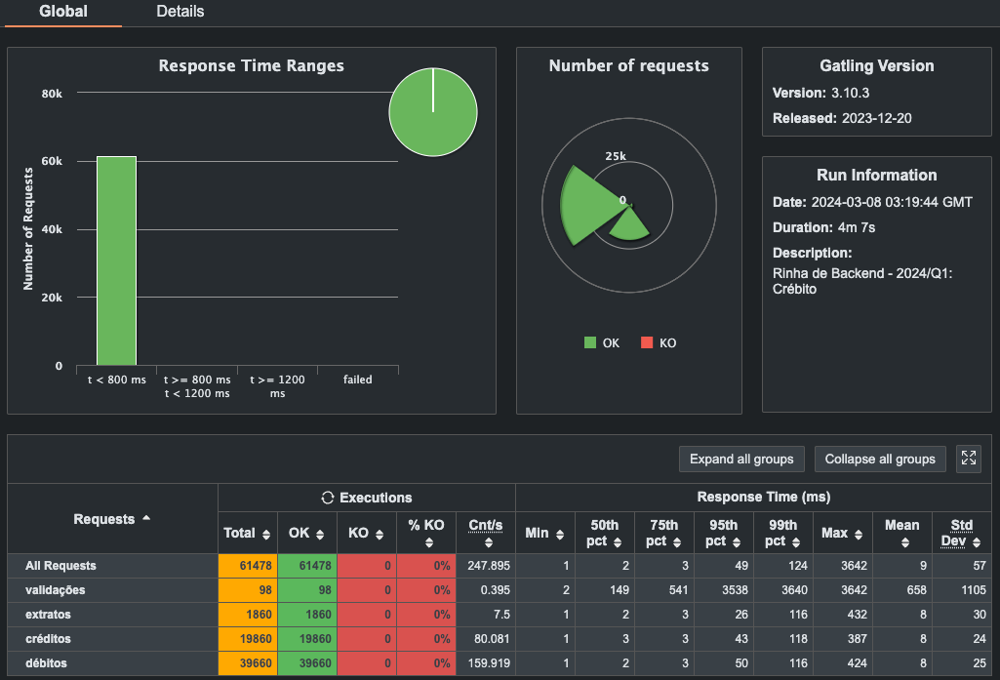

= Rinha de Backend 2024 Q1

image:https://img.shields.io/badge/vert.x-4.5.3-purple.svg[link="https://vertx.io"]

This application is a simple implementation to the https://github.com/zanfranceschi/rinha-de-backend-2024-q1/tree/main?tab=readme-ov-file[rinha-de-backend-2024-q1] challenge using Kotlin and Vert.x web framework.

* #PS:# This implementation doesn't consider some good practices and patterns like clean code. It's focused in reach the requirements and pass in the stress test with the best performance possible.

== Another implementations
In each branch I'll find another implementations to solve the same problem using different approaches.

* `v1`:
** Use of `Advisory Locks` to avoid the concurrency issues of the challenge.
** A cache memory of clients id and account limits data to avoid 1 select query.
** Two tables were created, `clients` and `transactions`, and the transaction table keeps the client's `balance` data. The last transaction will hold the current client's `balance` data.
* `v2`:
** Use of `Pessimistic Locking` to avoid the concurrency issues of the challenge.
** Two tables were created, `clients` and `transactions` and each insert in transaction table is done together with an update in the client's `balance` data.
* `v3`:
** Same of `v2` but using *GraalVM* to compile the application to a native image.
* `v4`:
** This version has some performance configuration for *NGINX* and *PostgreSQL*. But it's still handling the logic and validations in the application layer and using the same database schema of the previous versions.

== Tech Stack
* Kotlin
* Vert.x Framework
* Postgres
* Nginx Proxy
* Docker

== Running it locally

[source,bash]
----
git clone git@github.com:lucaslgr/rinha-backend-2024-01-kotlin.git
cd rinha-backend-2024-01-kotlin
docker compose up -d
----

== Results

== Running the stress test
[source, bash]
----
# Downloading gatling
curl -o gatling.zip https://repo1.maven.org/maven2/io/gatling/highcharts/gatling-charts-highcharts-bundle/3.10.3/gatling-charts-highcharts-bundle-3.10.3-bundle.zip
unzip gatling.zip
rm -Rf gatling.zip
mkdir -p ~/gatling/3.10.3
sudo mv gatling-charts-highcharts-bundle-3.10.3-bundle ~/gatling/3.10.3/
export GATLING_HOME=~/gatling/3.10.3

# Running the stress test
git clone git@github.com:zanfranceschi/rinha-de-backend-2024-q1.git
./executar-teste-local.sh
----

== Social Networks
* https://www.youtube.com/channel/UCyvw5MVEOueAyE2PqNXVkYw[Youtube]
* https://www.linkedin.com/in/lucas-guimar%C3%A3es-rocha/[Linkedin]
* https://github.com/lucaslgr[Github]

